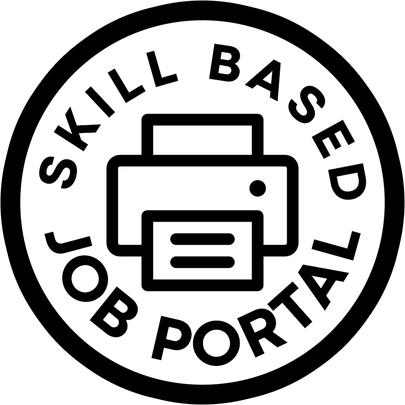

# IS212 G5 T4 Software Project Management Project: Skill Based Role Portal

<div align="center"  style="background-color:white;">
  <a href="https://github.com/mchangye/g5t4SPMproject">
    
  </a>

  <p align="center">
    Our Skill Based Role Portal is a platform that empowers our employees to find their perfect role by matching their skills with the requirements of various role listings within the company. Our portal simplifies the process of transferring to a different department, ensuring a seamless and skill-driven role search experience.
    <br />
    <a href="https://github.com/mchangye/g5t4SPMproject"><strong>Explore the docs »</strong></a>
    <br />
    <br />
    <a href="https://github.com/mchangye/g5t4SPMproject">View Demo</a>
    ·
    <a href="https://github.com/mchangye/g5t4SPMproject/issues">Report Bug</a>
    ·
    <a href="https://github.com/mchangye/g5t4SPMproject/issues">Request Feature</a>
  </p>

</div>

## Member Information

| Members               | School Email     | LinkedIn                                                      |
| --------------------- | ---------------- | ------------------------------------------------------------- |
| Jon Tiong Jun Wei     | jon.tiong.2021   | [@LinkedIn](https://sg.linkedin.com/in/jon-tiong)             |
| Chang Yu Ern Matthew  | yechang.2021     | [@LinkedIn]()               |
| Chen Jing             | jing.chen.2021   | [@LinkedIn]() |
| Dexter Ong Qing Yang  | dexter.ong.2021  | [@LinkedIn](https://sg.linkedin.com/in/dexter-ongqy)          |
| Tay Wei Sern          | weisern.tay.2021 | [@LinkedIn](https://sg.linkedin.com/in/tay-wei-sern)          |
| Leroy Tham Jun Han    | leroy.tham.2021  | [@LinkedIn](https://sg.linkedin.com/in/leroy-tham-971881214)  |

### Project Structure

```
📦G5T4SPMProject
 ┣ 📂 node_modules
 ┣ 📂 public
 ┣ 📂 .github
 ┣ 📂 .vscode
 ┣ 📂 __pycache__
 ┃
 ┣ 📂 Database
 ┃ ┣ 📂 Sample_Data
 ┃ ┃ # 6 different csvs
 ┃ ┃ ┣ 📜 role.csv
 ┃ ┃ ┣ 📜 skill.csv
 ┃ ┃ ┣ ...
 ┃ ┃ 
 ┃ ┃ # SQL file for creating tables
 ┃ ┗ 📜 SBRP_Data_Tables_Jon.sql
 ┃
 ┣ 📂 src
 ┃ ┣ 📂 assets
 ┃ ┣ 📂 components 
 ┃ ┃
 ┃ ┣ 📂 router
 ┃ ┃ ┗ 📜 index.js
 ┃ ┃
 ┃ ┣ 📂 views
 ┃ ┃ # 14 different views 
 ┃ ┃ ┣ 📜 AboutView.vue
 ┃ ┃ ┣ 📜 BrowseRolesHRView.vue
 ┃ ┃ ┣ 📜 UpdateRoleListing.vue
 ┃ ┃ ┣ ...
 ┃ ┃
 ┃ ┣ 📜 App.vue
 ┃ ┣ 📜 event-bus.js
 ┃ ┗ 📜 main.js
 ┃
 ┃ # dependencies for the vue app
 ┣ 📜 package.json       
 ┣ 📜 package-lock.json
 ┃
 ┃ # vue.js config files
 ┣ 📜 vite.config.js
 ┃
 ┃ # python files
 ┣ 📜 app.py
 ┣ 📜 unit_tests.py
 ┣ 📜 test_main.py
 ┣ 📜 missing_skills_test.py
 ┃
 ┃ # html files
 ┣ 📜 index.html
 ┃
 ┃ # gitignore
 ┣ 📜.gitignore
 ┃
 ┣ 📜 requirements.txt
 ┗ 📜 README.md
```

## Technologies Used

[Go To Top](#is212-g5-54-software-project-management-project:-skill-based-role-portal)

### Front End Development (Core Libraries)

> Front End was developed on Node with VUE-CLI. 

| Library    | Description             | Link                                   |
| ---------- | ----------------------- | -------------------------------------- |
| create-vue | Framework               | [Create Vue](https://vuejs.org/)       |
| Bootstrap  | Navbar, Toasts, Filters | [Bootstrap](https://getbootstrap.com/) |

### Front End Styling

> Bootstrap was the Main Library for styling

| Library / Tool | Description          | Link                                   |
| -------------- | -------------------- | -------------------------------------- |
| Bootstrap CSS  | Grid, Flex Utilities | [Bootstrap](https://getbootstrap.com/) |

### Back End (Core Libraries)

> Back End is coded in Python with Flask-SQLAlchemy.

| Library          | Description                      | Link                                                                       |
| ---------------- | -------------------------------- | -------------------------------------------------------------------------- |
| Flask-SQLAlchemy | Relational databases with Python | [Flask-SQLAlchemy](https://flask-sqlalchemy.palletsprojects.com/en/3.1.x/) |

### Version Control

> Project files are hosted on Github 

| Service | Description                                         | Link                         |
| ------- | --------------------------------------------------- | ---------------------------- |
| Github  | Version Control collaborative environment using Git | [Github](https://github.com) |

## How to Install and Run Our Web Application (for Developers) ##

[Go To Top](#is212-g5-54-software-project-management-project:-skill-based-role-portal)

### Project Setup

##### Tools Required

| Tool   | Download                                           |
| ------ | -------------------------------------------------- |
| NodeJS | [Download NodeJS](https://nodejs.org/en/download/) |

### Installing Libraries

##### Front End (Vue)

```
# From Project Root Change Directory to the g5t4spmproject folder (The Folder with package.json)

cd g5t4spmproject

# Install Dependencies for npm

npm i

# If there are any other missing libraries, install them according to the instructions given by the terminal.
```

### Running the Development Server

```
# From Project Root Change Directory to the g5t4spmproject folder (The Folder with package.json)

cd g5t4spmproject
```

##### We will need to run 2 terminals; 1 for the front-end, and 1 for the back-end.

```
# for terminal 1

npm run dev
```
```
# for terminal 2

python app.py

# If there are any other missing libraries, install them according to the instructions given by the terminal.
```

Open a browser (preferably Google Chrome) and enter http://localhost:5173/ to access the SBRP!

##### Login Credentials

| User type    | User ID |
| ------------ | ------- |
| Normal Staff | 140004  |
| HR Staff     | 140001  |

### Preferred Device

Computer

- System: Windows/Mac
- Viewport (width x height): 1920px x 1080px

We chose this aspect ratio as we commonly expect the staff using SBRP to be on their office laptops.

[Go To Top](#is212-g5-54-software-project-management-project:-skill-based-role-portal)